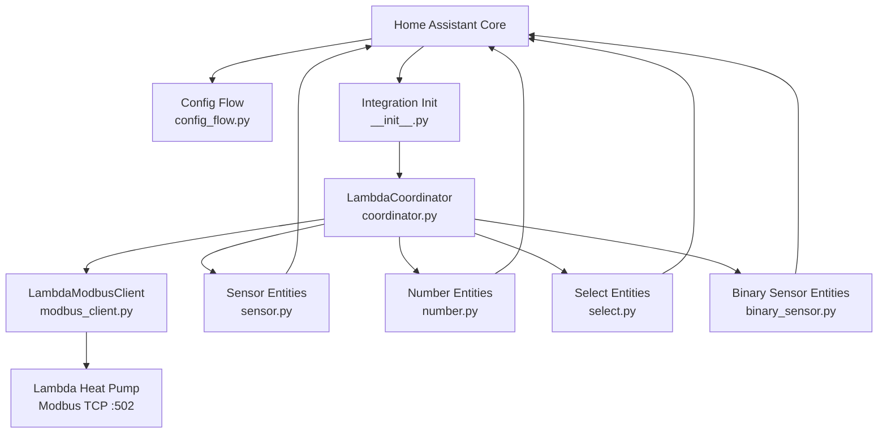
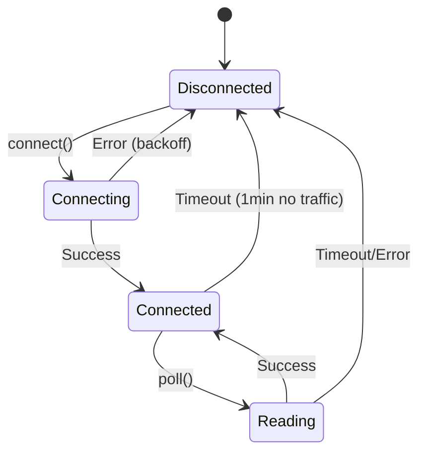

# Design Document: Lambda Heat Pump Home Assistant Integration

## Overview

This integration connects Lambda heat pumps to Home Assistant via Modbus TCP as a Custom Integration (HACS-compatible). It is based on the `DataUpdateCoordinator` pattern from Home Assistant and uses `pymodbus` for Modbus communication. A persistent TCP connection is maintained throughout the runtime.

**Technology Stack:**
- Python 3.11+
- Home Assistant Core 2024.1+
- `pymodbus >= 3.6.0` (async TCP client)
- `hypothesis >= 6.0` (property-based testing)
- HACS-compatible directory structure

---

## Architecture



**Data Flow:**
1. `LambdaCoordinator` calls `async_refresh()` every 30 seconds (configurable)
2. `LambdaModbusClient` reads all configured registers in batches
3. Raw data is stored in the Coordinator's `data` dict keyed by register address
4. Entities read their values from the Coordinator dict
5. Write operations go directly through `LambdaModbusClient`

---

## Directory Structure

```
custom_components/lambda_heat_pump/
├── __init__.py              # Integration setup/teardown
├── manifest.json            # HACS/HA metadata
├── config_flow.py           # UI configuration wizard
├── coordinator.py           # DataUpdateCoordinator
├── modbus_client.py         # Persistent Modbus TCP connection
├── const.py                 # Constants and register definitions
├── entity_base.py           # Base class for all entities
├── sensor.py                # Sensor entities (RO)
├── binary_sensor.py         # Binary sensor entities
├── number.py                # Number entities (RW)
├── select.py                # Select entities (RW enum)
├── strings.json             # UI texts (English)
└── translations/
    └── en.json              # English translations
```

---

## Components and Interfaces

### LambdaModbusClient (`modbus_client.py`)

Manages the persistent Modbus TCP connection.

```python
class LambdaModbusClient:
    def __init__(self, host: str, port: int) -> None: ...

    async def connect(self) -> bool:
        """Establish connection. Returns True on success."""

    async def disconnect(self) -> None:
        """Close connection cleanly."""

    async def read_registers(
        self, address: int, count: int
    ) -> list[int] | None:
        """Read `count` holding registers starting at `address`.
        Returns None on error."""

    async def write_registers(
        self, address: int, values: list[int]
    ) -> bool:
        """Write values starting at `address`. Returns True on success."""

    @property
    def is_connected(self) -> bool: ...
```

**Connection Management:**
- Uses `pymodbus.client.AsyncModbusTcpClient`
- Keep-alive: Every 45 seconds a dummy read on register 0 is performed if no other traffic occurred
- Reconnect: Exponential backoff (5s -> 10s -> 20s -> ... -> 300s max)
- All operations are serialized via an `asyncio.Lock`

### LambdaCoordinator (`coordinator.py`)

Inherits from `DataUpdateCoordinator`. Coordinates polling and manages active write values.

```python
class LambdaCoordinator(DataUpdateCoordinator[dict[int, int]]):
    def __init__(
        self,
        hass: HomeAssistant,
        client: LambdaModbusClient,
        config: dict,
    ) -> None: ...

    async def _async_update_data(self) -> dict[int, int]:
        """Read all configured registers. Returns dict {address: value}."""

    async def async_write_register(
        self, address: int, value: int
    ) -> bool:
        """Write a value and store it for RW refresh."""

    async def _async_refresh_rw_registers(self) -> None:
        """Re-write all active RW registers (00-49) before 5-min timeout."""
```

**Polling Strategy:**
- All registers of all configured modules are read in a single `_async_update_data` call
- Registers are grouped by address range and read as contiguous blocks (minimizes Modbus requests)
- RW registers with Number 00-49 are automatically re-written every 4 minutes

### Config Flow (`config_flow.py`)

```python
class LambdaHeatPumpConfigFlow(ConfigFlow, domain=DOMAIN):
    async def async_step_user(
        self, user_input: dict | None = None
    ) -> FlowResult: ...

    async def async_step_reconfigure(
        self, user_input: dict | None = None
    ) -> FlowResult: ...

class LambdaHeatPumpOptionsFlow(OptionsFlow):
    async def async_step_init(
        self, user_input: dict | None = None
    ) -> FlowResult: ...
```

**Configuration Fields:**

| Field | Type | Default | Validation |
|-------|------|---------|------------|
| `host` | str | - | Valid IP or hostname |
| `port` | int | 502 | 1-65535 |
| `num_heatpumps` | int | 1 | 1-5 |
| `num_heating_circuits` | int | 0 | 0-12 |
| `num_boilers` | int | 0 | 0-5 |
| `num_buffers` | int | 0 | 0-5 |
| `num_solar` | int | 0 | 0-2 |
| `enable_ambient` | bool | false | true/false |
| `enable_emanager` | bool | false | true/false |
| `scan_interval` | int | 30 | 10-300 (seconds) |

---

## Data Models

### Register Address Calculation

```
address = index * 1000 + subindex * 100 + number

Examples:
- Heat pump 1, register 04 (T-flow):      1 * 1000 + 0 * 100 + 4  = 1004
- Heat pump 2, register 04 (T-flow):      1 * 1000 + 1 * 100 + 4  = 1104
- Heating circuit 1, register 00:         5 * 1000 + 0 * 100 + 0  = 5000
- Heating circuit 12, register 06:        5 * 1000 + 11 * 100 + 6 = 6106
- General Ambient, register 02:           0 * 1000 + 0 * 100 + 2  = 2
- General E-Manager, register 02:         0 * 1000 + 1 * 100 + 2  = 102
- Boiler 5, register 50:                  2 * 1000 + 4 * 100 + 50 = 2450
- Solar 2, register 51:                   4 * 1000 + 1 * 100 + 51 = 4151
```

### Register Definitions (`const.py`)

Each register is described as a `RegisterDefinition`:

```python
@dataclass
class RegisterDefinition:
    number: int               # Datapoint number (00-99)
    name: str                 # Internal name
    label: str                # Display name
    access: str               # "RO" or "RW"
    data_type: str            # "UINT16", "INT16", "INT32"
    unit: str | None          # Unit (C, kW, W, l/min, %)
    scale: float              # Scaling factor (e.g. 0.01 for 0.01 C)
    device_class: str | None  # HA Device Class
    state_class: str | None   # HA State Class
    options: dict[int, str] | None  # Enum values for Select/Sensor
    min_value: float | None   # For Number entities
    max_value: float | None   # For Number entities
    step: float               # Step size for Number entities
```

### Complete Register Tables

#### Heat Pump (Index 1, Subindex 0-4)

| Number | Name | Access | Type | Unit | Scale | HA Device Class | HA State Class |
|--------|------|--------|------|------|-------|-----------------|----------------|
| 00 | hp_error_state | RO | UINT16 | - | 1 | problem | - |
| 01 | hp_error_number | RO | INT16 | - | 1 | - | measurement |
| 02 | hp_state | RO | UINT16 | - | 1 | - | - |
| 03 | operating_state | RO | UINT16 | - | 1 | - | - |
| 04 | t_flow | RO | INT16 | C | 0.01 | temperature | measurement |
| 05 | t_return | RO | INT16 | C | 0.01 | temperature | measurement |
| 06 | vol_sink | RO | INT16 | l/min | 0.01 | volume_flow_rate | measurement |
| 07 | t_eq_in | RO | INT16 | C | 0.01 | temperature | measurement |
| 08 | t_eq_out | RO | INT16 | C | 0.01 | temperature | measurement |
| 09 | vol_source | RO | INT16 | l/min | 0.01 | volume_flow_rate | measurement |
| 10 | compressor_rating | RO | UINT16 | % | 0.01 | power_factor | measurement |
| 11 | qp_heating | RO | INT16 | kW | 0.1 | power | measurement |
| 12 | fi_power | RO | INT16 | W | 1 | power | measurement |
| 13 | cop | RO | INT16 | - | 0.01 | - | measurement |
| 14 | request_password | RW | UINT16 | - | 1 | - | - |
| 15 | request_type | RW | INT16 | - | 1 | - | - |
| 16 | request_flow_temp | RW | INT16 | C | 0.1 | temperature | - |
| 17 | request_return_temp | RW | INT16 | C | 0.1 | temperature | - |
| 18 | request_temp_diff | RW | INT16 | K | 0.1 | - | - |
| 19 | relay_2nd_stage | RO | INT16 | - | 1 | - | - |
| 20-21 | stat_energy_e | RO | INT32 | Wh | 1 | energy | total_increasing |
| 22-23 | stat_energy_q | RO | INT32 | Wh | 1 | energy | total_increasing |

#### Boiler (Index 2, Subindex 0-4)

| Number | Name | Access | Type | Unit | Scale | HA Device Class | HA State Class |
|--------|------|--------|------|------|-------|-----------------|----------------|
| 00 | boiler_error_number | RO | INT16 | - | 1 | - | - |
| 01 | boiler_operating_state | RO | UINT16 | - | 1 | - | - |
| 02 | boiler_temp_high | RO | INT16 | C | 0.1 | temperature | measurement |
| 03 | boiler_temp_low | RO | INT16 | C | 0.1 | temperature | measurement |
| 04 | boiler_temp_circulation | RO | INT16 | C | 0.1 | temperature | measurement |
| 05 | boiler_pump_state | RO | INT16 | - | 1 | - | - |
| 50 | boiler_max_temp | RW | INT16 | C | 0.1 | temperature | - |

#### Buffer (Index 3, Subindex 0-4)

| Number | Name | Access | Type | Unit | Scale | HA Device Class | HA State Class |
|--------|------|--------|------|------|-------|-----------------|----------------|
| 00 | buffer_error_number | RO | INT16 | - | 1 | - | - |
| 01 | buffer_operating_state | RO | UINT16 | - | 1 | - | - |
| 02 | buffer_temp_high | RO | INT16 | C | 0.1 | temperature | measurement |
| 03 | buffer_temp_low | RO | INT16 | C | 0.1 | temperature | measurement |
| 04 | buffer_modbus_temp_high | RW | INT16 | C | 0.1 | temperature | - |
| 05 | buffer_request_type | RW | INT16 | - | 1 | - | - |
| 06 | buffer_request_flow_temp | RW | INT16 | C | 0.1 | temperature | - |
| 07 | buffer_request_return_temp | RW | INT16 | C | 0.1 | temperature | - |
| 08 | buffer_request_temp_diff | RW | INT16 | K | 0.1 | - | - |
| 09 | buffer_request_capacity | RW | INT16 | kW | 0.1 | power | - |
| 50 | buffer_max_temp | RW | INT16 | C | 0.1 | temperature | - |

#### Solar (Index 4, Subindex 0-1)

| Number | Name | Access | Type | Unit | Scale | HA Device Class | HA State Class |
|--------|------|--------|------|------|-------|-----------------|----------------|
| 00 | solar_error_number | RO | INT16 | - | 1 | - | - |
| 01 | solar_operating_state | RO | UINT16 | - | 1 | - | - |
| 02 | solar_collector_temp | RO | INT16 | C | 0.1 | temperature | measurement |
| 03 | solar_buffer1_temp | RO | INT16 | C | 0.1 | temperature | measurement |
| 04 | solar_buffer2_temp | RO | INT16 | C | 0.1 | temperature | measurement |
| 50 | solar_max_buffer_temp | RW | INT16 | C | 0.1 | temperature | - |
| 51 | solar_buffer_changeover_temp | RW | INT16 | C | 0.1 | temperature | - |

#### Heating Circuit (Index 5, Subindex 0-11)

| Number | Name | Access | Type | Unit | Scale | HA Device Class | HA State Class |
|--------|------|--------|------|------|-------|-----------------|----------------|
| 00 | hc_error_number | RO | INT16 | - | 1 | - | - |
| 01 | hc_operating_state | RO | UINT16 | - | 1 | - | - |
| 02 | hc_flow_temp | RO | INT16 | C | 0.1 | temperature | measurement |
| 03 | hc_return_temp | RO | INT16 | C | 0.1 | temperature | measurement |
| 04 | hc_room_temp | RW | INT16 | C | 0.1 | temperature | measurement |
| 05 | hc_setpoint_flow_temp | RW | INT16 | C | 0.1 | temperature | - |
| 06 | hc_operating_mode | RW | INT16 | - | 1 | - | - |
| 07 | hc_target_flow_temp | RO | INT16 | C | 0.1 | temperature | measurement |
| 50 | hc_offset_flow_temp | RW | INT16 | K | 0.1 | - | - |
| 51 | hc_setpoint_room_heating | RW | INT16 | C | 0.1 | temperature | - |
| 52 | hc_setpoint_room_cooling | RW | INT16 | C | 0.1 | temperature | - |

#### General Ambient (Index 0, Subindex 0)

| Number | Name | Access | Type | Unit | Scale | HA Device Class | HA State Class |
|--------|------|--------|------|------|-------|-----------------|----------------|
| 00 | ambient_error_number | RO | INT16 | - | 1 | - | - |
| 01 | ambient_operating_state | RO | UINT16 | - | 1 | - | - |
| 02 | ambient_temp_actual | RW | INT16 | C | 0.1 | temperature | measurement |
| 03 | ambient_temp_avg_1h | RO | INT16 | C | 0.1 | temperature | measurement |
| 04 | ambient_temp_calculated | RO | INT16 | C | 0.1 | temperature | measurement |

#### General E-Manager (Index 0, Subindex 1)

| Number | Name | Access | Type | Unit | Scale | HA Device Class | HA State Class |
|--------|------|--------|------|------|-------|-----------------|----------------|
| 00 | emanager_error_number | RO | INT16 | - | 1 | - | - |
| 01 | emanager_operating_state | RO | UINT16 | - | 1 | - | - |
| 02 | emanager_actual_power | RW | UINT16/INT16 | W | 1 | power | measurement |
| 03 | emanager_power_consumption | RO | INT16 | W | 1 | power | measurement |
| 04 | emanager_power_setpoint | RO | INT16 | W | 1 | power | measurement |

> Note: Register 02 of E-Manager uses UINT16 when configured for input power (0-65535W) or INT16 when configured for excess power (-32768-32767W). The integration reads the raw value and interprets it according to the system configuration setting stored in the config entry.


### Enum Definitions

**HP Error State (Register 00, Heat Pump):**
```python
HP_ERROR_STATE = {0: "NONE", 1: "MESSAGE", 2: "WARNING", 3: "ALARM", 4: "FAULT"}
```

**HP State (Register 02, Heat Pump):**
```python
HP_STATE = {
    0: "INIT", 1: "REFERENCE", 2: "RESTART-BLOCK", 3: "READY",
    4: "START PUMPS", 5: "START COMPRESSOR", 6: "PRE-REGULATION",
    7: "REGULATION", 9: "COOLING", 10: "DEFROSTING",
    20: "STOPPING", 30: "FAULT-LOCK", 31: "ALARM-BLOCK", 40: "ERROR-RESET"
}
```

**HP Operating State (Register 03, Heat Pump):**
```python
HP_OPERATING_STATE = {
    0: "STBY", 1: "CH", 2: "DHW", 3: "CC", 4: "CIRCULATE",
    5: "DEFROST", 6: "OFF", 7: "FROST", 8: "STBY-FROST",
    10: "SUMMER", 11: "HOLIDAY", 12: "ERROR", 13: "WARNING",
    14: "INFO-MESSAGE", 15: "TIME-BLOCK", 16: "RELEASE-BLOCK",
    17: "MINTEMP-BLOCK", 18: "FIRMWARE-DOWNLOAD"
}
```

**HP Request Type (Register 15, Heat Pump):**
```python
HP_REQUEST_TYPE = {
    0: "NO REQUEST", 1: "FLOW PUMP CIRCULATION",
    2: "CENTRAL HEATING", 3: "CENTRAL COOLING", 4: "DOMESTIC HOT WATER"
}
```

**Boiler Operating State (Register 01, Boiler):**
```python
BOILER_OPERATING_STATE = {
    0: "STBY", 1: "DHW", 2: "LEGIO", 3: "SUMMER", 4: "FROST",
    5: "HOLIDAY", 6: "PRO-STOP", 7: "ERROR", 8: "OFF",
    9: "PROMPT-DHW", 10: "TRAILING-STOP", 11: "TEMP-LOCK", 12: "STBY-FROST"
}
```

**Buffer Operating State (Register 01, Buffer):**
```python
BUFFER_OPERATING_STATE = {
    0: "STBY", 1: "HEATING", 2: "COOLING", 3: "SUMMER", 4: "FROST",
    5: "HOLIDAY", 6: "PRO-STOP", 7: "ERROR", 8: "OFF", 9: "STBY-FROST"
}
```

**Buffer Request Type (Register 05, Buffer):**
```python
BUFFER_REQUEST_TYPE = {
    -1: "INVALID REQUEST", 0: "NO REQUEST",
    1: "FLOW PUMP CIRCULATION", 2: "CENTRAL HEATING", 3: "CENTRAL COOLING"
}
```

**Solar Operating State (Register 01, Solar):**
```python
SOLAR_OPERATING_STATE = {
    0: "STBY", 1: "HEATING", 2: "SUMMER", 3: "ERROR", 4: "OFF"
}
```

**Heating Circuit Operating State (Register 01, Heating Circuit):**
```python
HC_OPERATING_STATE = {
    0: "HEATING", 1: "ECO", 2: "COOLING", 3: "FLOORDRY", 4: "FROST",
    5: "MAX-TEMP", 6: "ERROR", 7: "SERVICE", 8: "HOLIDAY",
    9: "CH-SUMMER", 10: "CC-WINTER", 11: "PRIO-STOP", 12: "OFF",
    13: "RELEASE-OFF", 14: "TIME-OFF", 15: "STBY", 16: "STBY-HEATING",
    17: "STBY-ECO", 18: "STBY-COOLING", 19: "STBY-FROST", 20: "STBY-FLOORDRY"
}
```

**Heating Circuit Operating Mode (Register 06, Heating Circuit):**
```python
HC_OPERATING_MODE = {
    0: "OFF", 1: "MANUAL", 2: "AUTOMATIC", 3: "AUTO-HEATING",
    4: "AUTO-COOLING", 5: "FROST", 6: "SUMMER", 7: "FLOORDRY"
}
```

**General Ambient Operating State (Register 01, Ambient):**
```python
AMBIENT_OPERATING_STATE = {
    0: "OFF", 1: "AUTOMATIK", 2: "MANUAL", 3: "ERROR"
}
```

**General E-Manager Operating State (Register 01, E-Manager):**
```python
EMANAGER_OPERATING_STATE = {
    0: "OFF", 1: "AUTOMATIK", 2: "MANUAL", 3: "ERROR", 4: "OFFLINE"
}
```

### Entity Naming Scheme

```
Entity ID:    lambda_heat_pump_{module_type}_{instance}_{datapoint}
              e.g.: lambda_heat_pump_heatpump_1_t_flow
              e.g.: lambda_heat_pump_heating_circuit_3_hc_room_temp
              e.g.: lambda_heat_pump_ambient_1_ambient_temp_actual

Unique ID:    {config_entry_id}_{module_type}_{subindex}_{number}
              e.g.: abc123_heatpump_0_4

Display name: Lambda {ModuleType} {Instance} {Datapoint}
              e.g.: Lambda Heat Pump 1 Flow Temperature
              e.g.: Lambda Heating Circuit 3 Room Temperature
              e.g.: Lambda Ambient Actual Temperature
```

### Coordinator Data Structure

```python
# coordinator.data: dict[register_address, raw_value]
{
    # General Ambient (Index 0, Subindex 0)
    2: 215,     # Ambient actual temp = 21.5 C (raw * 0.1)
    3: 200,     # Ambient avg 1h = 20.0 C
    4: 195,     # Ambient calculated = 19.5 C

    # General E-Manager (Index 0, Subindex 1)
    102: 1500,  # E-Manager actual power = 1500W

    # Heat Pump 1 (Index 1, Subindex 0)
    1000: 0,    # HP1 Error State = NONE
    1004: 4523, # HP1 T-flow = 45.23 C (raw * 0.01)
    1005: 3891, # HP1 T-return = 38.91 C

    # Heat Pump 2 (Index 1, Subindex 1)
    1100: 0,    # HP2 Error State

    # Boiler 1 (Index 2, Subindex 0)
    2002: 550,  # Boiler1 high temp = 55.0 C (raw * 0.1)

    # Buffer 1 (Index 3, Subindex 0)
    3002: 450,  # Buffer1 high temp = 45.0 C

    # Solar 1 (Index 4, Subindex 0)
    4002: 820,  # Solar collector temp = 82.0 C

    # Heating Circuit 1 (Index 5, Subindex 0)
    5002: 350,  # HC1 flow temp = 35.0 C

    # Heating Circuit 12 (Index 5, Subindex 11)
    6102: 220,  # HC12 flow temp = 22.0 C
}
```

---

## Correctness Properties

*A property is a characteristic or behavior that should hold true across all valid executions of a system - essentially, a formal statement about what the system should do. Properties serve as the bridge between human-readable specifications and machine-verifiable correctness guarantees.*

### Property 1: Register Address Calculation Round-Trip

*For all* valid combinations of Index (0-5), Subindex (0-11), and Number (0-99), the calculated register address must be unique, and back-calculating from the address must yield the original values (Index, Subindex, Number).

Reasoning: The address formula `Index * 1000 + Subindex * 100 + Number` is injective within the valid value range. Back-calculation via integer division and modulo must restore the original triple. This ensures no two different registers share the same address. The extended subindex range (0-11 for heating circuits) and the general modules (Index 0) are included.

**Validates: Requirements 4.2, 6.6, 9.5**

### Property 2: Scaling Round-Trip

*For all* raw INT16/UINT16 register values and all scaling factors defined in the specification (0.01, 0.1, 1), the following must hold: `scaled_to_raw(raw_to_scaled(raw_value, scale), scale) == raw_value`.

Reasoning: Scaling is a simple multiplication/division. The round-trip ensures that when writing setpoints (e.g. flow temperature), the correct raw value is sent to the heat pump.

**Validates: Requirements 4.1, 5.1, 6.1, 6.2, 6.3, 6.4, 9.1, 9.2**

### Property 3: Enum Mapping Completeness

*For all* defined enum registers across all module types (HP Error State, HP State, HP Operating State, HP Request Type, Boiler Operating State, Buffer Operating State, Buffer Request Type, Solar Operating State, HC Operating State, HC Operating Mode, Ambient Operating State, E-Manager Operating State), every raw value defined in the Modbus specification must map to a non-empty string, and no unknown value must produce an empty string or raise an exception.

Reasoning: Unknown enum values (e.g. from firmware updates) should be handled gracefully and return a fallback string.

**Validates: Requirements 4.3, 5.1, 6.1, 6.2, 6.3, 6.4, 9.1, 9.2**

### Property 4: INT32 Composition Round-Trip

*For all* valid INT32 values in the range [-2^31, 2^31-1], the following must hold: `combine_int32(split_int32(value)) == value`, where `split_int32` splits the value into two UINT16 registers and `combine_int32` reassembles them.

Reasoning: The statistics registers (energy consumption, thermal output) are encoded as INT32 across two consecutive 16-bit registers. An error here would produce incorrect energy values.

**Validates: Requirement 4.5**

### Property 5: Configuration Validation

*For all* inputs outside the defined ranges (port outside 1-65535, num_heatpumps outside 1-5, num_heating_circuits outside 0-12, num_boilers outside 0-5, num_buffers outside 0-5, num_solar outside 0-2, invalid IP addresses), the Config Flow must reject the input and return an error code. *For all* valid inputs within the ranges, the Config Flow must accept the input.

Reasoning: Invalid configurations would lead to runtime errors or incorrect address calculations. The extended ranges (heating circuits 0-12, boilers/buffers 0-5, solar 0-2) must all be validated correctly.

**Validates: Requirements 1.1, 1.2, 1.3**

### Property 6: Entity Unique IDs Are Distinct

*For all* valid configurations (any combination of module counts within the defined limits), all generated unique IDs must be pairwise distinct.

Reasoning: Duplicate unique IDs would cause Home Assistant to overwrite entities or raise errors. This is especially important with the extended module counts (12 heating circuits, 5 boilers, 5 buffers, 2 solar, plus ambient and E-Manager).

**Validates: Requirement 7.1**

### Property 7: Entity Count Is Deterministic from Configuration

*For all* valid configurations, the number of created entities must exactly equal the sum of entities for all configured modules:
- Each heat pump: 22 entities (17 sensors + 5 controls)
- Each boiler: 7 entities (6 sensors + 1 control)
- Each buffer: 11 entities (4 sensors + 7 controls)
- Each solar module: 7 entities (5 sensors + 2 controls)
- Each heating circuit: 11 entities (5 sensors + 6 controls)
- Ambient (if enabled): 5 entities (4 sensors + 1 control)
- E-Manager (if enabled): 5 entities (4 sensors + 1 control)

For module types with count 0 or disabled boolean flags, no entities are created.

Reasoning: Too many or too few entities would indicate a bug in entity generation. The formula must account for all module types including the new general modules.

**Validates: Requirements 1.5, 4.1, 5.1, 6.1, 6.2, 6.3, 6.4, 6.5, 9.1, 9.2, 9.3, 9.4**

### Property 8: RW Write Values Are Stored in Refresh Store

*For all* RW registers with Number 00-49 that are written, the Coordinator must store the written value in the internal refresh store so it can be re-written in the next refresh cycle.

Reasoning: Without this mechanism, setpoints would be discarded by the control unit as invalid after 5 minutes.

**Validates: Requirements 3.2, 5.3**

---

## Error Handling

### Connection State Machine



**Error Classes:**
- `ConnectionError`: Connection could not be established -> backoff, entities `unavailable`
- `ModbusException`: Protocol error -> log WARNING, entity `unavailable`
- `TimeoutError`: No response -> mark connection as interrupted, reconnect
- `ValueError`: Invalid register value -> log WARNING, entity `unavailable`

### Write Errors

- Password error (Register 14): After 10 failed attempts -> log ERROR, user notification via HA Persistent Notification
- Range violation: Caught at the Number entity layer before any Modbus write occurs

---

## Testing Strategy

### Unit Tests

Focus on isolated components with a mocked Modbus client:

- `test_register_address_calculation.py`: Address calculation for all module types including general modules (Index 0) and extended ranges
- `test_data_scaling.py`: Scaling and unit conversion
- `test_config_flow.py`: Validation of all Config Flow inputs including new fields (num_solar, enable_ambient, enable_emanager)
- `test_coordinator.py`: Polling logic, RW refresh timing
- `test_modbus_client.py`: Reconnect logic, keep-alive

### Property-Based Tests

Uses `hypothesis` as the property-based testing library (minimum 100 iterations per test).

**Tag format:** `# Feature: lambda-heat-pump-ha-integration, Property {N}: {description}`

- **Property 1**: Register address calculation round-trip
  - Generator: Random (index, subindex, number) triples within valid ranges (index 0-5, subindex 0-11, number 0-99)
  - Assertion: address -> back-calculation -> same original values

- **Property 2**: Scaling round-trip
  - Generator: Random INT16/UINT16 raw values, random scaling factors from the specification (0.01, 0.1, 1)
  - Assertion: `scaled_to_raw(raw_to_scaled(v, s), s) == v`

- **Property 3**: Enum mapping completeness
  - Generator: All defined enum raw values from the specification for all 12 enum types
  - Assertion: Every value returns a non-empty string

- **Property 4**: INT32 round-trip
  - Generator: Random INT32 values in range [-2^31, 2^31-1]
  - Assertion: `combine_int32(split_int32(v)) == v`

- **Property 5**: Config validation
  - Generator: Random inputs for all configuration fields including new fields (num_heating_circuits 0-12, num_boilers 0-5, num_buffers 0-5, num_solar 0-2, enable_ambient bool, enable_emanager bool), including boundary values and invalid values
  - Assertion: Invalid inputs are always rejected, valid inputs always accepted

- **Property 6**: Unique ID distinctness
  - Generator: Random configurations (various module counts within extended limits)
  - Assertion: All generated unique IDs are pairwise distinct

- **Property 7**: Entity count determinism
  - Generator: Random valid configurations with all module types
  - Assertion: `len(entities) == sum(expected_entities_per_module_type)` using the per-module entity counts defined in Property 7

- **Property 8**: RW refresh store
  - Generator: Random RW register addresses with Number 00-49 and random values
  - Assertion: After writing, the value is present in the refresh store

**Configuration:** Each property test runs with `@settings(max_examples=100)`.

### Integration Tests

- `test_integration_setup.py`: Full setup/teardown with a mocked Modbus server
- `test_entity_creation.py`: Correct count and types of created entities for various configurations including all new module types
